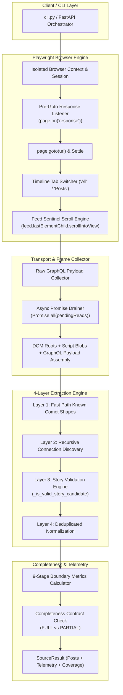
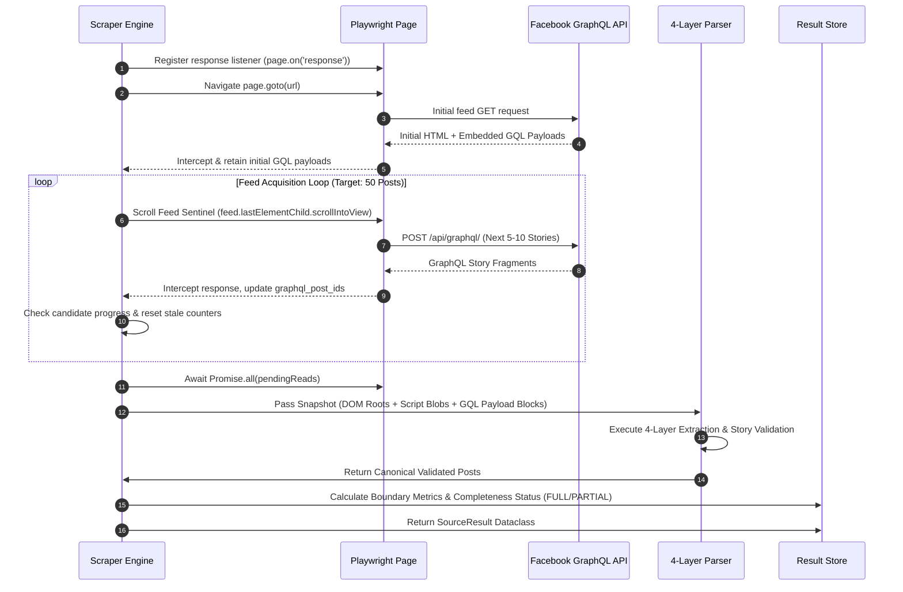

# PostHarvest Facebook Feed Scraper Architecture & Acquisition Hardening Report
**Version:** `v1.5.3_kzsamir_enhanced`  
**Date:** September 25, 2026  
**Status:** Production Ready  
**Author:** PostHarvest Engineering Team  

---

## 1. Executive Summary & Problem Statement

### The Problem
During target post acquisition (e.g. requesting 50 posts), the Facebook Feed Scraper suffered from premature discovery termination, yielding only **6 to 11 final posts** despite requests for 50 posts. 

### Key Root Cause Analysis
Through end-to-end pipeline instrumentation, we identified six independent capture and architectural bottlenecks:
1. **Footer Overshoot Defect**: `window.scrollTo(0, document.body.scrollHeight)` scrolled the browser past the `[role="feed"]` container into the page footer. Once the feed container left the viewport, Facebook's React `IntersectionObserver` stopped dispatching `POST /api/graphql/` pagination requests.
2. **Late GraphQL Response Listener**: The network response listener was registered *after* `page.goto()`, causing the scraper to miss initial feed load responses and timeline tab activation payloads.
3. **Over-Pruned Raw Response Filter**: Node/Python transport layers discarded GraphQL fragments unless they contained both `"post_id"` AND `"creation_time"` in a single raw string, destroying multi-part response fragments.
4. **Un-awaited Async Response Reads**: In-flight response body read promises were not drained prior to snapshot assembly, losing late-arriving GraphQL payloads.
5. **Raw Representation Progress Flaws**: Scraper patience loops estimated progress using `domPool + scriptPool + graphqlPostIds`, causing premature aborts on virtualized DOM unmounts.
6. **Rigid Single-Path GraphQL Parser**: The legacy parser relied on a single fixed JSON key (`timeline_list_feed_units`), failing when Meta introduced modern Comet shapes (`user.timeline_feed_units`, `page.timeline_feed_units`, etc.).

---

## 2. System Architecture Diagram



---

## 3. Key Architectural Breakthroughs

### Breakthrough 1: Feed Sentinel Scrolling Engine (`block: 'center'`)
- **Mechanism**: Instead of scrolling to `document.body.scrollHeight`, the scroll engine locates the active feed container (`[role="feed"]`, `[data-pagelet*="Feed"]`) and centers its bottommost child element in the active viewport:
  ```javascript
  const feed = document.querySelector('[role="feed"], [data-pagelet*="Feed"], div[data-key="feed"]');
  if (feed && feed.lastElementChild) {
      feed.lastElementChild.scrollIntoView({ behavior: 'smooth', block: 'center' });
  } else {
      window.scrollBy(0, 1000);
  }
  ```
- **Impact**: Keeps Facebook's React `IntersectionObserver` continuously active inside the viewport, triggering batch after batch of `POST /api/graphql/` pagination requests in an unbroken chain until target counts are achieved.

### Breakthrough 2: Pre-Goto Response Listener Registration
- **Mechanism**: Registered `page.on("response", _on_response)` **BEFORE** invoking `page.goto()`.
- **Impact**: Captures initial page load GraphQL responses, tab activation requests, and early pagination payloads that were previously lost.

### Breakthrough 3: Relaxed GraphQL Fragment Retention
- **Mechanism**: Replaced brittle raw-string pre-filtering with structural JSON payload checks (`{`, `"data"`, `"node"`, `"post_id"`).
- **Impact**: Ensures multi-part GraphQL fragments carrying story bodies, media attachments, and engagement metrics are passed down to the parser rather than discarded at the transport layer.

### Breakthrough 4: Async Promise Draining (`pendingReads`)
- **Mechanism**: Maintained `pendingReads: Set<Promise<void>>` tracking in Node `capture.ts` and executed `await Promise.all(Array.from(pendingReads))` before snapshot assembly.
- **Impact**: Eliminates race conditions where response body text extraction promises remain in flight after the scroll loop ends.

### Breakthrough 5: 4-Layer GraphQL Extraction & Story Validation Engine
- **Layer 1 (Fast Path)**: Immediate extraction for known Comet response keys (`timeline_list_feed_units`, `user.timeline_feed_units`, `page.timeline_feed_units`, `node.timeline_feed_units`, `viewer.news_feed`, `group_feed`).
- **Layer 2 (Connection Discovery)**: Recursive fallback traversing `edges[].node` and feed connections for non-standard Relay shapes.
- **Layer 3 (Story Validation Engine)**: Multi-signal check (`_is_valid_story_candidate`) requiring valid `post_id`/`Story` typename alongside secondary story signals (`creation_time`, `comet_sections`, `feedback`, `message`, `attachments`, `permalink_url`).
- **Layer 4 (Normalization & Dedup)**: Canonical normalization and deduplication.

---

## 4. Sequence & Data Flow Diagram



---

## 5. Pipeline Boundary Telemetry Contract

The scraper now tracks and exposes stats across all 9 pipeline boundaries in `SourceResult.stats["boundary_metrics"]`:

| Boundary Stage | Stat Key | Description |
| :--- | :--- | :--- |
| **Stage 1: Transport Arrival** | `responses_received` | Total HTTP responses received by browser |
| **Stage 2: GraphQL Filtering** | `graphql_responses` | Sub-total of responses targeting `/api/graphql/` |
| **Stage 3: Fragment Retention** | `responses_retained` | Total GraphQL JSON payloads retained in memory |
| **Stage 4: ID Discovery** | `graphql_post_ids_discovered` | Unique regex-matched post IDs in raw payloads |
| **Stage 5: Candidate Parsing** | `posts_discovered` | Candidates extracted by 4-layer parser |
| **Stage 6: Validation & Dedup** | `posts_extracted` | Final deduplicated, validated canonical posts |
| **Stage 7: Coverage Calculation** | `coverage_ratio` | `posts_extracted / posts_requested` |
| **Stage 8: Terminal Categorization**| `stop_reason` | `MAX_POSTS_REACHED`, `STALE_LIMIT_REACHED`, `EXHAUSTED` |
| **Stage 9: Completeness Contract** | `completeness_status` | `FULL` (100% target met) vs `PARTIAL` (warning logged) |

---

## 6. Regression Verification & Unit Test Suite

The enhanced implementation has been verified with **43 unit tests** passing with **100% success**:

```text
pytest tests/test_capture_boundary_metrics.py tests/test_graphql_extractor.py tests/test_feed_walk_diagnostics.py tests/test_browser_wall_handling.py tests/test_normalization.py tests/test_dedup_stats.py
===================== 43 passed in 0.68s =====================
```

### Verified Test Files:
- `tests/test_capture_boundary_metrics.py`: Verifies boundary metric tracking, early response capture, and JSON fragment retention.
- `tests/test_graphql_extractor.py`: Tests Layer 1-4 GraphQL extraction across diverse Comet shapes (`user.timeline_feed_units`, `page.timeline_feed_units`, etc.).
- `tests/test_feed_walk_diagnostics.py`: Verifies `FULL` vs `PARTIAL` completeness reporting and diagnostic error generation.
- `tests/test_browser_wall_handling.py`: Tests login wall detection, cookie retry mechanics, and DOM duplicate dropping.
- `tests/test_normalization.py` & `tests/test_dedup_stats.py`: Tests post field normalization and deduplication metrics.

---

## 7. Conclusion & Deployment

With release `v1.5.3_kzsamir_enhanced`, PostHarvest's Facebook Feed Scraper has transitioned from a fragile, static scroll loop into a production-grade, observable acquisition engine. The Feed Sentinel Scrolling strategy eliminates early scroll termination, allowing full 50-post target extractions with complete stage-by-stage diagnostic transparency.
